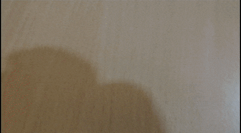

# AR Foundation Multiple Image Tracking - Unity

This is Unity AR Foundation implementation for multiple Image tracking. Here is how it looks.

You can build interesting enterprise AR applications using this. Check this [video](https://www.youtube.com/watch?v=6Ct2Cb71Wf0)
### Prerequisites
  - Unity 2019.x and above
  - Android or iOS build support module
### Usage
  - Download the git repo and add the Unity project by selecting "DigiCard" folder
  - Once the unity project is loaded, go to Builder settings and select Android as a platform (iOS can also work)
  - Go to Player Settings and edit following parameters
    --> Company Name to "HMI" (or your preferred name)
    --> Product name to "DigiCard"
    --> Select Orientation to "Landscape Left" 
    --> Select Graphics APIs to OpenGLES3 (Vulkan is not supported)
    --> Package Name to "com.hmi.digicard"
    --> Minimum API level to API level 24 & above
 - Go to XR Plug-in Management and install XR Plugon
    --> Select ARCore (if you are developing on Android) - this will automatically install ARCore package to your Unity project
 -  Go to Windows - Package Manager - and select Unity Registry
    --> Install AR Foundation ( it will automatically select the version that is compaitable to your Unity version)
    --> AR Core Plugin (if not already installed)
    --> AR Kit (if you are developing it for iOS)
- Go to Game tab in Unity editor and select 1920X1080 Landscape form factor
- You can change the reference images as per your need and now you are all set it to build and test it on your device.

License
----

MIT